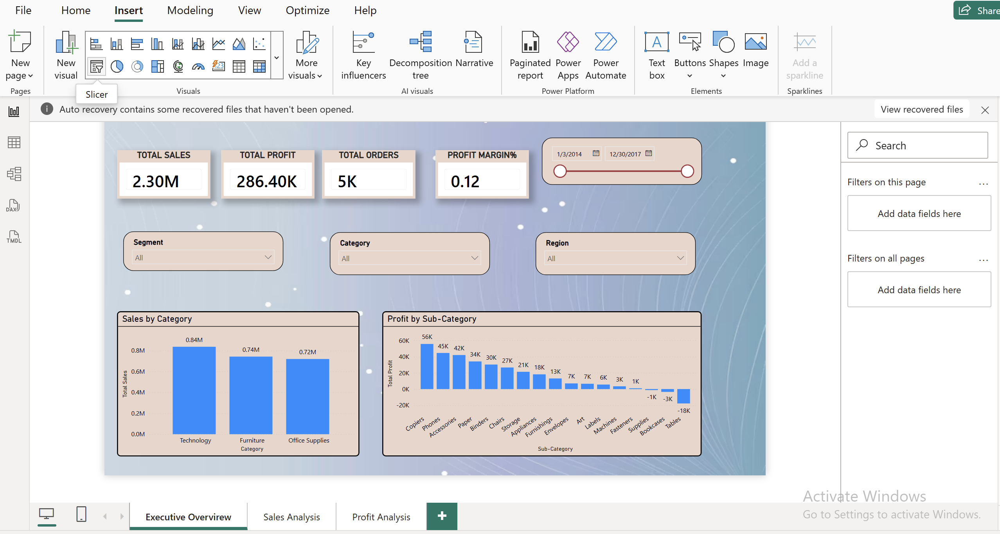
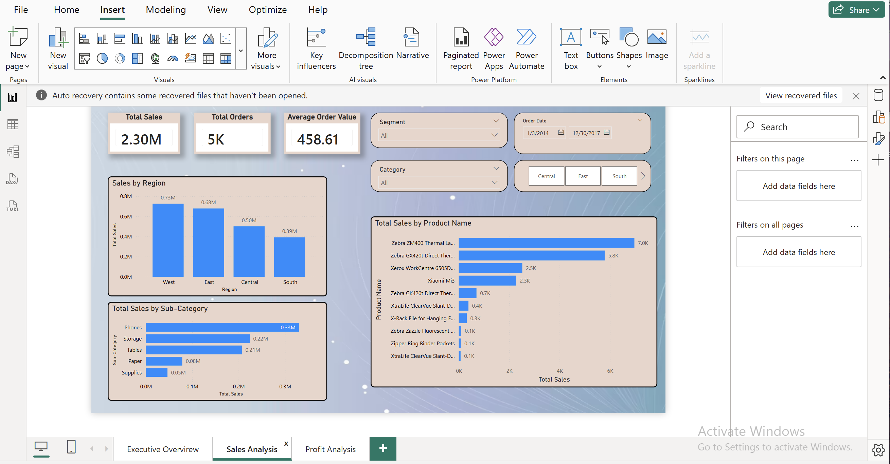
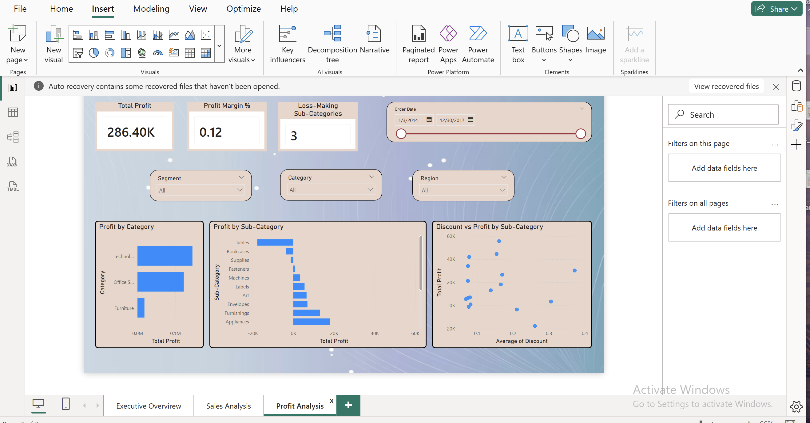

# Retail Sales & Profitability Analysis (SQL + Power BI)

## Project Overview
This project focuses on analyzing retail sales data to uncover insights related to revenue, profitability, discounts, and product performance.
It demonstrates practical SQL querying skills and the ability to translate data into actionable business insights using Power BI.

This project was built as a **portfolio project** for entry-level Data Analyst / Business Analyst roles.

## Tools & Technologies
- SQL (data extraction and analysis)
- Power BI (data modeling, DAX, interactive dashboards)
- Excel / CSV (source dataset)

## Key Business Metrics
- Total Sales
- Total Profit
- Total Orders
- Profit Margin %
- Average Order Value
- Loss-Making Sub-Categories

## Dashboard Features
- Sales and profit analysis by **category, sub-category, region, and product**
- Identification of **loss-making sub-categories**
- Discount vs Profit analysis to evaluate pricing impact
- Interactive slicers for date range, segment, category, and region
- Top-performing products and regions by total sales

## SQL Analysis
The SQL scripts include:
- Sales and profit aggregation queries
- Profit margin calculations
- Monthly sales and profit trend analysis
- Product and category performance analysis
- Discount impact analysis

All SQL queries are available in the `SQL/` folder.

## Power BI Dashboard

The Power BI dashboard file is available in the `Power bi/` folder:
- retail superstore.pbix

## Dashboard Screenshots

### Executive Overview

### Sales Analysis

### Profit Analysis

## Key Insights
- Technology category generates the highest sales and profit
- Certain sub-categories (e.g. Tables, Bookcases) consistently incur losses
- Higher discounts are associated with reduced profitability
- West region outperforms other regions in total sales

## Conclusion
This project demonstrates an end-to-end data analytics workflow:
from SQL-based analysis to insight-driven Power BI dashboards,
aligned with real-world business decision-making.

